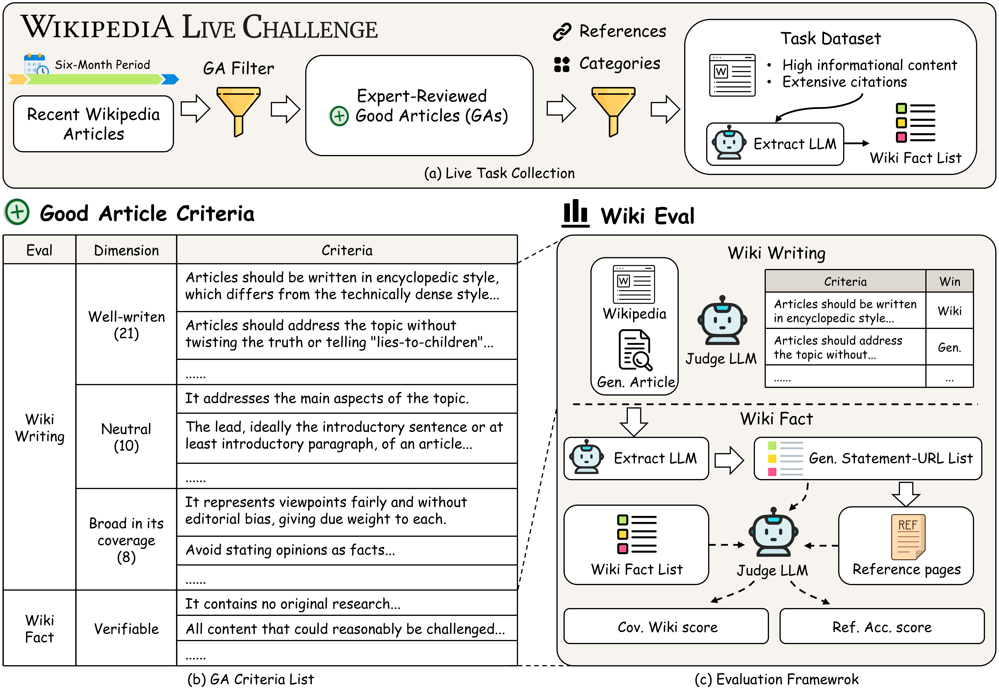
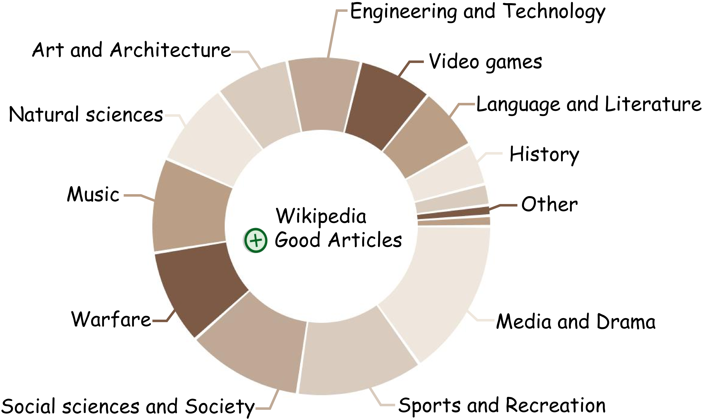

<h1 align="center">Wiki Live Challenge: Challenging Deep Research Agents with Expert-Level Wikipedia Articles</h1>

<div align="center">
<a href="https://github.com/WangShao2000/Wiki_Live_Challenge/blob/main/LICENSE"></a>
<a href="http://agentresearchlab.org/benchmarks/wiki-live-challenge/index.html#home"></a>
<a href="https://huggingface.co/datasets/muset-ai/Wiki_Live_Challenge"></a>
<a href="https://huggingface.co/spaces/muset-ai/Wiki-Live-Challenge-Leaderboard"></a>
<!-- <a href="https://arxiv.org/abs/2506.11763" target="_blank"></a> -->

<h5 align="center"> If you like our project, please give us a star ⭐ on GitHub for the latest update.</h5>

</div>

## ✨ News
+ [30 Jan 2026] **Initial Release**: Wiki Live Challenge v1.0 with the first live benchmark dataset `2025_Mar_Nov` (100 Wikipedia articles). Evaluation framework supports Wiki Writing and Wiki Fact (Verifiability + Citation) dimensions.

## 📖 Overview

**Wiki Live Challenge** is a benchmark for evaluating Deep Research Agents (DRAs) on their ability to generate Wikipedia-quality articles. Unlike static benchmarks, Wiki Live Challenge uses **live Wikipedia articles** that are continuously updated, ensuring that evaluation remains challenging and relevant over time.

### Key Features

- **Live Benchmark**: Uses recently created/updated Wikipedia articles as ground truth
- **Multi-dimensional Evaluation**: Assesses both writing quality and factual accuracy
- **GA-based Criteria**: Evaluation based on Wikipedia's Good Article (GA) standards

## Benchmark Construction



### Live Task Collection

Wiki Live Challenge constructs benchmark tasks from **Wikipedia Good Articles (GAs)** - articles that have been reviewed by Wikipedia editors and meet rigorous quality standards. Our collection process:

1. **Six-Month Rolling Window**: We continuously collect newly promoted GAs within a six-month period to ensure tasks reflect current events and topics
2. **GA Filter**: Only articles meeting Wikipedia's Good Article criteria are included:
   - High informational content
   - Extensive citations with verifiable sources
   - Expert-reviewed quality standards
3. **Category Diversity**: Tasks span multiple Wikipedia categories to ensure comprehensive coverage

<p align="center">

</p>

### GA Criteria Extraction

From Wikipedia's Good Article criteria, we extract evaluation dimensions:

| Dimension | Category | Criteria Count | Description |
|-----------|----------|----------------|-------------|
| **Wiki Writing** | Well-written | 21 | Encyclopedic style, clear prose, proper lead section |
| | Broad in coverage | 8 | Topic coverage, focus, appropriate structure |
| | Neutral | 10 | Fair viewpoints, avoid opinions as facts |
| **Wiki Fact** | Verifiable | - | No original research, all claims properly sourced |


## Evaluation Framework

Wiki Live Challenge introduces two complementary evaluation dimensions to comprehensively assess Deep Research Agents:

### 📝 Wiki Writing (Criteria-based Quality Evaluation)

Wiki Writing evaluates **article generation quality** by comparing against Wikipedia ground truth:

- **Reference-Based Comparison**: LLM judges compare generated articles against Wikipedia GAs on each criterion
- **39 Criteria**: Comprehensive coverage across three categories:
  - 📚 **Well-written (21)**: Encyclopedic style, lead section quality, words to watch, etc.
  - 🔍 **Broad in coverage (8)**: Topic coverage, focus, structure completeness
  - ⚖️ **Neutral (10)**: Fair viewpoints, avoid editorial bias, due weight
- **Win Rate Metrics**: Percentage of criteria where generated article wins against Wikipedia

### 🔗 Wiki Fact (Factual Accuracy Evaluation)

Wiki Fact evaluates **information accuracy and citation quality** through two sub-dimensions:

**Verifiability**: Measures statement consistency between generated and Wikipedia articles
- **Statement Extraction**: LLM extracts factual statements from both articles
- **Semantic Matching**: Embeddings find top-k similar statement pairs
- **LLM Verification**: Judges determine support/conflict relationships
- **Metrics**: Coverage ratio, support ratio, conflict ratio

**Citation**: Verifies if statements are supported by their cited sources
- **Citation Fetching**: Retrieves content from cited URLs
- **Support Verification**: LLM judges whether citations support the claims
- **Metrics**: Citation support ratio, conflict ratio


## 📊 Evaluation Results

### Main Results

<!-- TODO: Add leaderboard link and results table -->
*Coming soon: Evaluation results and leaderboard*

---

## 🛠️ Installation and Usage

### Prerequisites

- Python 3.9+
- LLM API key (Gemini or OpenAI-compatible, for statement extraction and evaluation)
- OpenAI API key (for text embeddings in verifiability evaluation)
- Jina API key (for web content fetching in citation evaluation)

### Setup

```bash
git clone https://github.com/WangShao2000/Wiki_Live_Challenge.git
cd Wiki_Live_Challenge
pip install -r requirements.txt
```

### API Configuration

Copy `.env.example` to `.env` and fill in your API keys:

```bash
cp .env.example .env
```

Edit `.env` with your configuration:

```bash
# Jina API for web content fetching
JINA_API_KEY=your_jina_api_key_here

# LLM API for statement extraction (preprocessing)
EXTRACT_MODEL=gemini-2.5-flash
EXTRACT_API_KEY=your_api_key_here
EXTRACT_BASE_URL=your_api_base_url_here

# LLM API for fact verification (Wiki Fact evaluation)
VERIFIER_MODEL=gemini-2.5-flash
VERIFIER_API_KEY=your_api_key_here
VERIFIER_BASE_URL=your_api_base_url_here

# LLM API for writing evaluation (Wiki Writing evaluation)
# Recommended: Use a more capable model (e.g., gemini-2.5-pro)
WRITING_MODEL=gemini-2.5-pro
WRITING_API_KEY=your_api_key_here
WRITING_BASE_URL=your_api_base_url_here

# OpenAI Embedding API (for verifiability evaluation)
OPENAI_API_KEY=your_openai_api_key_here
OPENAI_BASE_URL=https://api.openai.com/v1
EMBEDDING_MODEL=text-embedding-3-small
```


## Project Structure

```
Wiki_Live_Challenge/
├── data/<benchmark_id>/            # e.g., 2025_Mar_Nov
│   ├── wiki_data/cleaned_data/     # Wikipedia ground truth
│   │   ├── article/                # Wiki MD files
│   │   └── statement/              # Wiki statement JSONs
│   └── test_data/                  # Generated articles
│       ├── agencies.json           # Agency registry
│       └── <agency>/               # Per-agency data
│           ├── md_data/            # Markdown articles
│           └── json_data/          # Processed JSONs
├── scripts/                        # CLI tools
│   ├── preprocess_md.py            # MD normalization
│   ├── generate_json.py            # JSON generation
│   ├── manage_agencies.py          # Agency management
│   └── run_evaluation.py           # Evaluation runner
├── evaluation/                     # Evaluation modules
│   ├── wiki_writing.py             # Writing evaluation
│   └── wiki_fact.py                # Fact evaluation
├── src/                            # Core libraries
├── .env.example                    # API config template
└── requirements.txt
```

### Live Benchmark Datasets

The project supports multiple live evaluation benchmarks that evolve over time:
- `2025_Mar_Nov`: Initial benchmark with Wikipedia articles from March-November 2025
- Future benchmarks will be added as `<year>_<start_month>_<end_month>`

Use `--benchmark` flag to specify which benchmark to evaluate against.

## Data Preprocessing

### Step 1: Register Your Agency

Before adding data for a new model/agency, register it in `agencies.json`:

```bash
# Register a new agency
python scripts/manage_agencies.py register my_agency \
  --name "My Model Name" \
  --desc "Description of the model"

# For models without citation references
python scripts/manage_agencies.py register my_agency --no-citations

# List all registered agencies
python scripts/manage_agencies.py list

# Validate registry
python scripts/manage_agencies.py validate
```

### Step 2: Prepare Markdown Files

Create the agency folder structure and add your markdown articles:

```bash
mkdir -p data/2025_Mar_Nov/test_data/my_agency/md_data
# Copy your .md files to md_data/
```

### Step 3: Preprocess Markdown (Optional)

Normalize markdown files to standard format:

```bash
# Preview format detection
python scripts/preprocess_md.py -i data/2025_Mar_Nov/test_data/my_agency/md_data/ --detect-only

# Normalize in place
python scripts/preprocess_md.py -i data/2025_Mar_Nov/test_data/my_agency/md_data/ --in-place
```

### Step 4: Generate JSON Data

Generate JSON files with statement extraction and citation fetching:

```bash
# Full pipeline (extract statements + fetch citations)
python scripts/generate_json.py \
  -i data/2025_Mar_Nov/test_data/my_agency/md_data/ \
  -o data/2025_Mar_Nov/test_data/my_agency/json_data/ \
  --steps extract,fetch

# Only extract statements (skip citation fetching)
python scripts/generate_json.py \
  -i data/2025_Mar_Nov/test_data/my_agency/md_data/ \
  -o data/2025_Mar_Nov/test_data/my_agency/json_data/ \
  --steps extract

# Only fetch citations (for existing JSON files)
python scripts/generate_json.py \
  -i data/2025_Mar_Nov/test_data/my_agency/md_data/ \
  -o data/2025_Mar_Nov/test_data/my_agency/json_data/ \
  --steps fetch

# Process single file
python scripts/generate_json.py \
  -i data/2025_Mar_Nov/test_data/my_agency/md_data/Article.md \
  -o data/2025_Mar_Nov/test_data/my_agency/json_data/Article.json
```

### JSON Data Format

The generated JSON files have the following structure:

```json
{
  "query": {
    "pages": {
      "<page_id>": {
        "title": "Article Title",
        "extract": "Clean article text without citations",
        "citation_urls": {
          "1": "https://example.com/source1",
          "2": "https://example.com/source2"
        },
        "statements": [
          {
            "fact": "Extracted factual statement",
            "ref_idx": "1",
            "url": "https://example.com/source1"
          }
        ],
        "citation_contents": {
          "1": {
            "url": "https://example.com/source1",
            "title": "Page Title",
            "content": "Fetched page content..."
          }
        },
        "source_file": "my_agency/md_data/Article.md"
      }
    }
  }
}
```

## Evaluation

### Quick Start

After registering your agency and preparing data, run evaluation with a single command:

```bash
# Full evaluation for your agency (Writing + Verifiability + Citation)
python scripts/run_evaluation.py all -b 2025_Mar_Nov -a my_agency -o results/my_agency/
```

This generates a summary report in `results/my_agency/` with all metrics.

### Available Commands

```bash
# List available benchmarks and agencies
python scripts/run_evaluation.py list -b 2025_Mar_Nov

# Run specific evaluation dimension
python scripts/run_evaluation.py writing -b 2025_Mar_Nov -a my_agency -o results/
python scripts/run_evaluation.py verifiability -b 2025_Mar_Nov -a my_agency -o results/
python scripts/run_evaluation.py citation -b 2025_Mar_Nov -a my_agency -o results/

# Run all evaluations at once
python scripts/run_evaluation.py all -b 2025_Mar_Nov -a my_agency -o results/
```

### Evaluation Dimensions

The framework evaluates articles across **2 main dimensions**:

```
Wiki Live Challenge Evaluation
├── Wiki Writing          # Criteria-based quality evaluation
│   ├── Well-written (21 criteria)
│   ├── Broad in coverage (8 criteria)
│   └── Neutral (10 criteria)
│
└── Wiki Fact             # Factual accuracy evaluation
    ├── Verifiability     # Statement consistency with Wikipedia
    └── Citation          # Citation source support
```

| Dimension | Sub-dimension | Description | Key Metrics |
|-----------|---------------|-------------|-------------|
| **Wiki Writing** | - | Wikipedia Manual of Style compliance (39 criteria) | Gen win rate |
| **Wiki Fact** | Verifiability | Statement consistency with Wikipedia | Support/Conflict ratio |
| **Wiki Fact** | Citation | Citation source support for statements | Support/Conflict ratio |

---

#### Wiki Writing

Compares writing quality against Wikipedia ground truth using **39 criteria** from Wikipedia Manual of Style:

| Category | Criteria Count | Examples |
|----------|----------------|----------|
| **Well-written** | 21 | Clear prose, lead section quality, words to watch |
| **Broad in coverage** | 8 | Topic coverage, focus, structure |
| **Neutral** | 10 | Fair viewpoints, avoid opinions as facts |

**Evaluation method:** LLM compares Gen vs Wiki article on each criterion, outputs winner (Gen/Wiki/Tie)

**Output metrics:**
- `gen_win_rate`: Percentage of criteria where generated article wins

---

#### Wiki Fact

Evaluates factual accuracy through two sub-dimensions:

**1. Verifiability**

Compares factual statements between generated article and Wikipedia:

| Direction | Question | Metric |
|-----------|----------|--------|
| Gen → Wiki | Are Gen statements supported by Wiki? | `gen_supported_by_wiki_ratio` |
| Gen → Wiki | Do Gen statements conflict with Wiki? | `gen_conflict_with_wiki_ratio` |
| Wiki → Gen | Does Gen cover Wiki content? | `wiki_covered_by_gen_ratio` |

**Evaluation method:** Embed statements → Find top-k similar → LLM verifies consistency

**2. Citation**

Verifies if statements are supported by their cited sources:

| Metric | Description |
|--------|-------------|
| `support_ratio` | % of statements supported by cited sources |
| `conflict_ratio` | % of statements conflicting with cited sources |

**Evaluation method:** Group statements by citation → LLM verifies statement against fetched citation content

### Output Structure

```
results/my_agency/
├── writing/
│   ├── Article1_writing.json      # Per-article detailed results
│   ├── Article2_writing.json
│   └── _summary.json              # Aggregated metrics
├── verifiability/
│   ├── Article1_verifiability.json
│   └── _summary.json
└── citation/
    ├── Article1_citation.json
    └── _summary.json
```

### Summary Report Format

Each `_summary.json` contains aggregated metrics:

```json
// writing/_summary.json
{
  "total_articles": 100,
  "total_gen_wins": 1500,
  "total_gt_wins": 2400,
  "gen_win_rate": 0.38
}

// verifiability/_summary.json
{
  "total_articles": 100,
  "avg_gen_supported_by_wiki": 0.42,
  "avg_gen_conflict_with_wiki": 0.08,
  "avg_wiki_covered_by_gen": 0.35
}

// citation/_summary.json
{
  "total_articles": 100,
  "completed_articles": 95,
  "avg_support_ratio": 0.52,
  "avg_conflict_ratio": 0.06
}
```

### Advanced Options

```bash
# Allow ties in writing evaluation (default: strict mode, no ties)
python scripts/run_evaluation.py writing -b 2025_Mar_Nov -a my_agency --allow-tie

# Adjust parallel workers
python scripts/run_evaluation.py all -b 2025_Mar_Nov -a my_agency --max-workers 30

# Evaluate specific categories only
python scripts/run_evaluation.py writing -b 2025_Mar_Nov -a my_agency --categories well_written neutral
```

### Evaluation Data Flow

| Evaluation | Generated Data | Ground Truth Data |
|------------|----------------|-------------------|
| **Writing** | `test_data/<agency>/json_data/*.json` (extract field) | `wiki_data/cleaned_data/article/*.md` |
| **Verifiability** | `test_data/<agency>/json_data/*.json` (statements) | `wiki_data/cleaned_data/statement/*.json` |
| **Citation** | `test_data/<agency>/json_data/*.json` (statements + citation_contents) | N/A |

### Evaluation Criteria Files

Evaluation criteria are defined in JSON format:
- `evaluation/data/wiki_writing_criteria.json`: Writing quality criteria (39 items)
- `evaluation/data/wiki_fact_criteria.json`: Fact verification criteria

## Acknowledgements

We would like to express our gratitude to the following contributors who helped us collect evaluation data. Since many models and agents do not provide public APIs, manual data collection was necessary, and we deeply appreciate their dedicated efforts:

**Xin Yang**, **Jiarui Zhu**, **Yawen Li**, **Lu Yu**, **Jiaqi He**, **Sukui Liu**, and **Lina Wang**.

Their contributions were essential to the comprehensive evaluation presented in this benchmark.

## Citation

If you use Wiki Live Challenge in your research, please cite our paper:

```bibtex
@article{wang2026wikilive,
  author    = {Shaohan Wang and Benfeng Xu and Licheng Zhang and Mingxuan Du and Chiwei Zhu and Xiaorui Wang and Zhendong Mao and Yongdong Zhang},
  title     = {Wiki Live Challenge: Challenging Deep Research Agents with Expert-Level Wikipedia Articles},
  journal   = {arXiv preprint},
  year      = {2026},
}
``` 